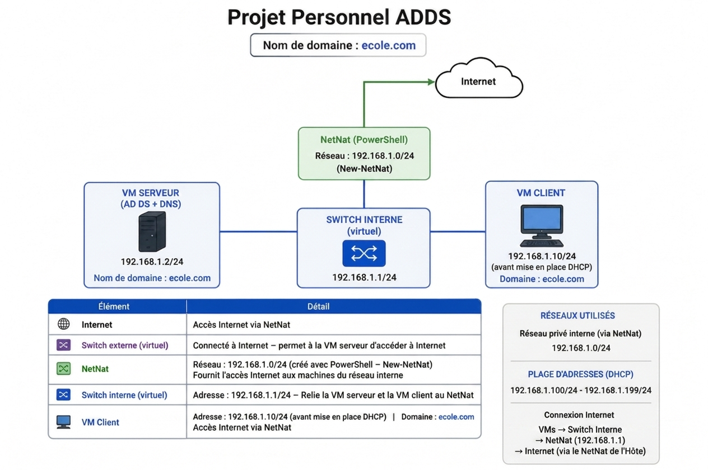

# Lab-Infrastructure : Déploiement d'un domaine AD DS et automatisation hybride

## 📄 Documentation Complète
**Le dossier technique complet, incluant la page de garde officielle et la table des matières, est disponible au format PDF :**
**[Télécharger le Dossier Technique PDF](./Lab_évolutif_CHEBEL.pdf)**
---

## 1. Présentation du Projet
L'objectif de ce projet personnel était de concevoir de bout en bout une architecture réseau virtualisée sous **Windows Server 2022**. Ce projet m'a permis de comprendre le fonctionnement d'une forêt Active Directory, de mettre en place une stratégie de sécurité par GPO et d'initier une démarche d'automatisation via PowerShell.

### Environnement technique :
* **Hyperviseur :** Hyper-V
* **Serveur :** Windows Server 2022 (Rôles : AD DS, DNS, DHCP)
* **Client :** Windows 10 Pro
* **Outils :** PowerShell, Gestionnaire de serveur, Éditeur de gestion des GPO

---

## 2. Architecture Réseau & Connectivité
L'originalité de ce lab repose sur la configuration réseau hybride permettant l'isolation du domaine tout en conservant un accès internet contrôlé via **NetNat**.

### Schéma Logique du Réseau

* **Domaine DNS :** `ecole.com`
* **Réseau Interne (Privé) :** `192.168.1.0/24`
* **Passerelle de l'hôte (Interface vEthernet) :** `192.168.1.1/24`
* **Contrôleur de domaine :** `192.168.1.2/24`
* **Plage DHCP :** `192.168.1.100` à `192.168.1.199`

---

## 3. Automatisation & Industrialisation (PowerShell)
Plutôt que de gérer les utilisateurs manuellement via l'interface graphique, une approche axée *Infrastructure as Code* (IaC) a été développée à travers trois scripts distincts :

1. **Création en masse (OnBoarding) :** `ADUser.ps1` -> Automatise l'intégration des comptes à partir d'un fichier CSV.
2. **Gestion des mutations :** `MoveADUser.ps1` -> Automatise le déplacement des objets utilisateurs vers leurs nouvelles Unités d'Organisation (OU).
3. **Archivage des départs (OffBoarding) :** `OffBoarding.ps1` -> Désactive les comptes, révoque les accès et déplace l'objet dans l'OU Archives pour éviter les comptes dormants.

---

## 4. Sécurité & Gouvernance (GPO)
L'annuaire Active Directory a été durci par le déploiement d'Objets de Stratégie de Groupe (GPO) liés directement aux Unités d'Organisation :
* **Politique de mots de passe :** Application d'une politique globale stricte (complexité, historique, longueur minimale).
* **Restrictions d'accès :** Verrouillage du Panneau de configuration et de l'invite de commande pour les utilisateurs non autorisés.
* **Délégation de contrôle :** Configuration des droits pour permettre à un profil d'administration junior (`Jean Dupont`) de gérer exclusivement son OU locale.

---

## 🛠️ Roadmap (Évolutions planifiées)
Le lab a été pensé dès sa conception pour évoluer vers une infrastructure de plus en plus mature et hautement sécurisée :
-  **Gestion Centralisée des Mises à Jour (WSUS)** : Déploiement du rôle et liaison d'une stratégie `GPO_Ordinateurs`.
-  **Services de fichiers et partages réseaux** : Gestion des droits NTFS et partages SMB.
-  **Sécurité Durcie (AppLocker)** : Contrôle de l'exécution des applications.
-  **Supervision & Alerting** : Script PowerShell de "Health Check" quotidien avec envoi de rapports par email.
